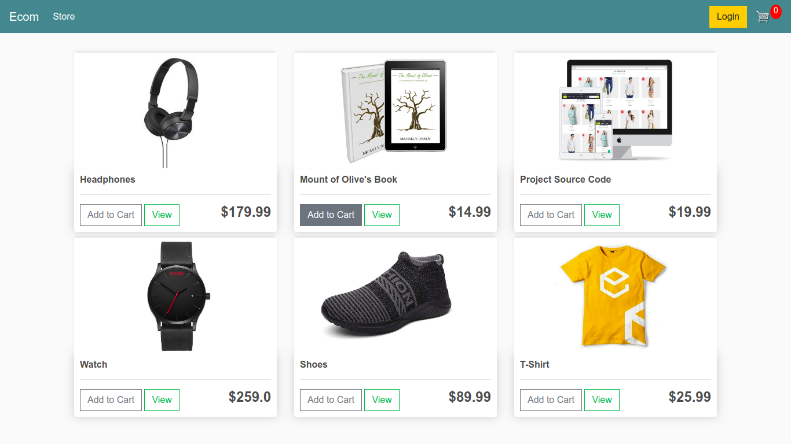
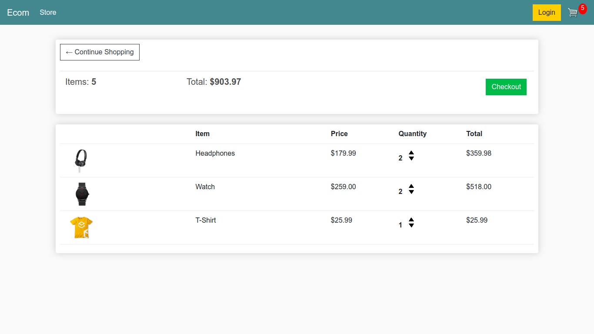
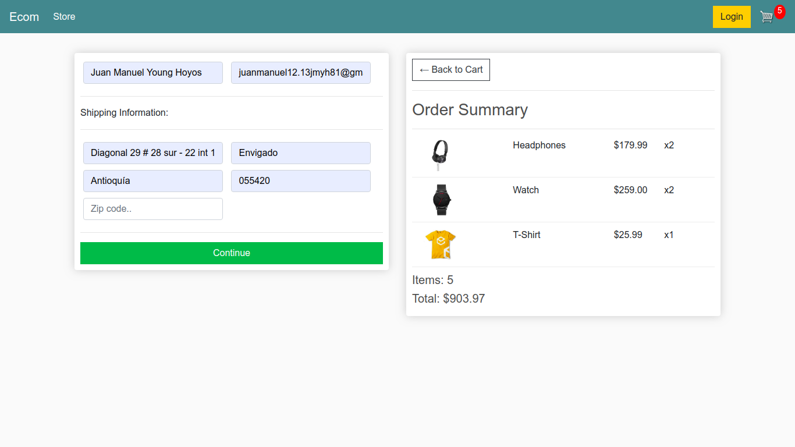
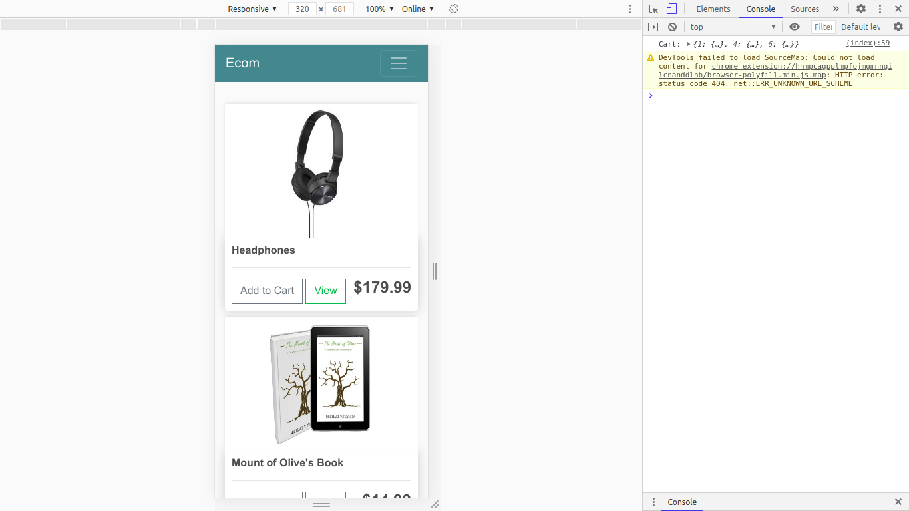
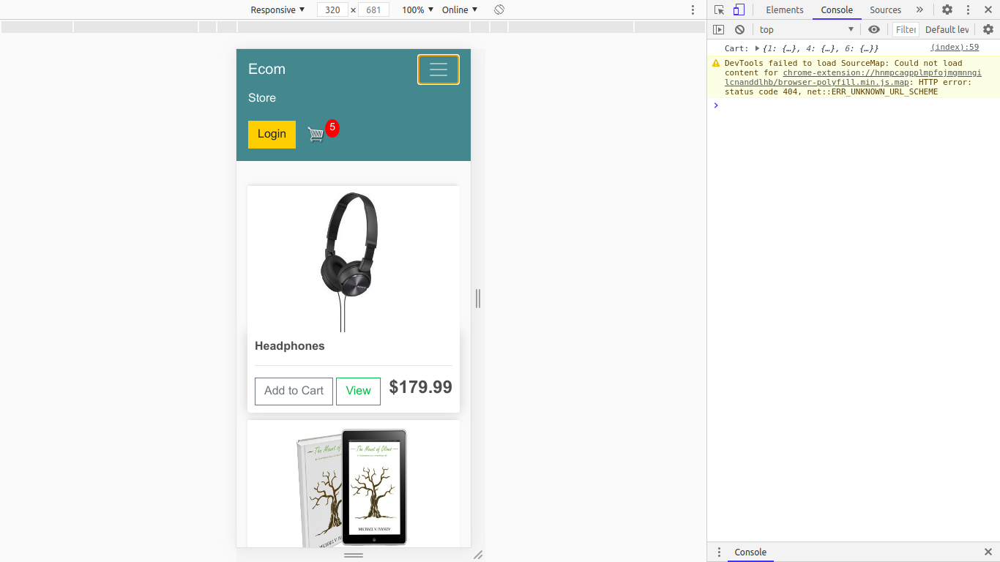
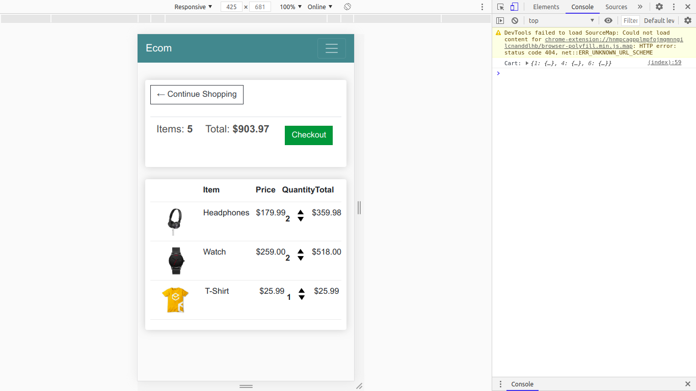
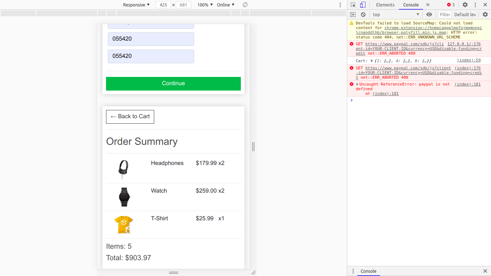

# Simple Django Ecommerce Template

The aim of this project is to learn the basics and intermediate concepts of Django

## How to execute it?

Open a terminal on the folder project and follow this steps.

- Windows:
```
    cd ecomerce/

    python manage.py migrate

    python manage.py runserver
```
- Linux:
```
    cd ecomerce/

    python3 manage.py migrate

    python3 manage.py runserver
```

## Some captures

Index



Shopping cart



Checkout



### Mobile version







